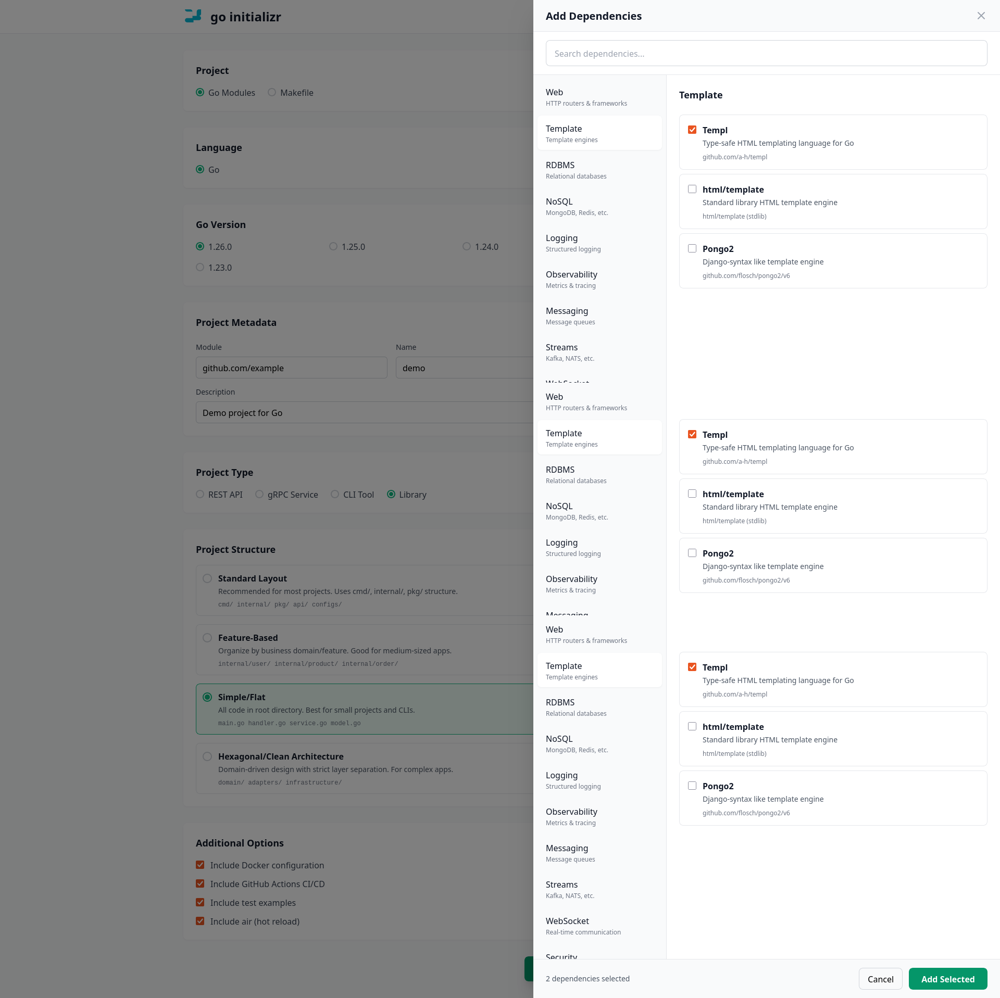

# Go Initializer - Backend Server

A web-based project generator for Go applications, similar to Spring Initializr.

---


## Features

- ✅ **Multiple Project Structures**: Standard, Flat, Feature-based, Hexagonal
- ✅ **Project Types**: REST API, CLI, gRPC, Library
- ✅ **Router Support**: Chi, Gin, Echo, Fiber, Standard Library
- ✅ **Logger Support**: Zerolog, Zap, Slog, Logrus
- ✅ **Optional Features**: Docker, GitHub Actions, Config management, Database support
- ✅ **50+ Dependencies**: Web frameworks, databases, logging, messaging, observability
- ✅ **Production-Ready Code**: Graceful shutdown, error handling, middleware
- ✅ **One-Click Download**: Generates a complete, runnable Go project as a ZIP file

## Quick Start

### Prerequisites

- Go 1.22 or higher

### Installation

```bash
# Clone the repository
git clone https://github.com/yourusername/go-initializer
cd go-initializer

# Install dependencies
go mod download

# Run the server
go run main.go
```

The server will start on `http://localhost:8080`

### Using Docker

```bash
# Build the image
docker build -t go-initializer .

# Run the container
docker run -p 8080:8080 go-initializer
```

## Project Structure

```
go-initializer-backend/
├── main.go                     # Entry point
├── server/
│   └── server.go              # HTTP server and handlers
├── generator/
│   ├── generator.go           # Template processing and zip generation
│   └── mappings.go            # Template-to-file mappings
├── templates/                  # Project templates
│   ├── standard/              # Standard Go layout
│   ├── flat/                  # Simple/flat structure
│   ├── feature/               # Feature-based structure
│   └── hexagonal/             # Hexagonal architecture (TODO)
├── web/
│   ├── templates/
│   │   └── index.html        # Frontend UI
│   └── static/               # Static assets
├── go.mod
└── README.md
```

## API Endpoints

### `POST /api/generate`

Generates a Go project based on the provided configuration.

**Request Body:**
```json
{
  "project_name": "myapi",
  "module": "github.com/user/myapi",
  "description": "My awesome API",
  "go_version": "1.22",
  "structure": "standard",
  "project_type": "rest-api",
  "router": "chi",
  "logger": "zerolog",
  "use_docker": true,
  "use_github": true,
  "use_config": true,
  "use_logger": true,
  "use_database": true,
  "use_redis": false,
  "use_jwt": false,
  "use_air": true,
  "dependencies": ["Chi Router", "PostgreSQL Driver (pgx)", "Zerolog"]
}
```

**Response:**
- Content-Type: `application/zip`
- Downloads a ZIP file containing the generated project

### `POST /api/preview`

Returns a list of files that would be generated for the given configuration.

**Request Body:** Same as `/api/generate`

**Response:**
```json
{
  "files": [
    {"path": "cmd/myapi/main.go", "size": 0},
    {"path": "internal/handler/handler.go", "size": 0},
    {"path": "Dockerfile", "size": 0}
  ]
}
```

## Configuration Options

### Project Structures

1. **Standard Layout** (Recommended)
   - `cmd/`, `internal/`, `pkg/`, `api/`, `configs/`
   - Best for: Production apps, teams, scalable projects

2. **Flat/Simple**
   - All files in root directory
   - Best for: Small projects, CLIs, prototypes

3. **Feature-Based**
   - `internal/user/`, `internal/product/`, etc.
   - Best for: Medium apps with clear business domains

4. **Hexagonal** (Coming Soon)
   - `domain/`, `adapters/`, `infrastructure/`
   - Best for: Complex enterprise apps, DDD

### Supported Routers

- **Chi** - Lightweight, idiomatic
- **Gin** - High performance
- **Echo** - Minimalist
- **Fiber** - Express-inspired
- **Standard Library** - No dependencies

### Supported Loggers

- **Zerolog** - Zero allocation
- **Zap** - Uber's fast logger
- **Slog** - Standard library (Go 1.21+)
- **Logrus** - Structured logger

## Development

### Building

```bash
go build -o go-initializer main.go
```

### Testing

```bash
go test ./...
```

### Adding New Templates

1. Create template file in `templates/[structure]/`
2. Add mapping in `generator/mappings.go`
3. Add conditions if needed
4. Test with different configurations

## Generated Project Example

When you generate a project with:
- Structure: Standard
- Type: REST API
- Router: Chi
- Logger: Zerolog
- Docker: Enabled

You get:

```
myapi/
├── cmd/myapi/main.go          # Complete server with graceful shutdown
├── internal/
│   ├── handler/handler.go     # HTTP handlers
│   ├── middleware/logger.go   # Logging middleware
│   └── config/config.go       # Configuration
├── pkg/logger/logger.go       # Zerolog wrapper
├── Dockerfile                 # Multi-stage build
├── docker-compose.yaml        # With PostgreSQL
├── Makefile                   # Build automation
├── .github/workflows/ci.yml   # CI/CD
├── go.mod
├── go.sum
└── README.md
```

The generated project is immediately runnable:

```bash
cd myapi
go run cmd/myapi/main.go
# Server starting on :8080
```

## Deployment

### Fly.io (Recommended)

```bash
fly apps create go-initializer

fly launch
fly deploy
```

### Railway

1. Connect your GitHub repository
2. Deploy automatically

### Docker

```bash
docker build -t go-initializer .
docker run -p 8080:8080 go-initializer
```
## Screenshots




## Contributing

Contributions are welcome! Please:

1. Fork the repository
2. Create a feature branch
3. Add tests for new features
4. Submit a pull request

## License

MIT License

## Credits

Inspired by [Spring Initializr](https://start.spring.io/)
